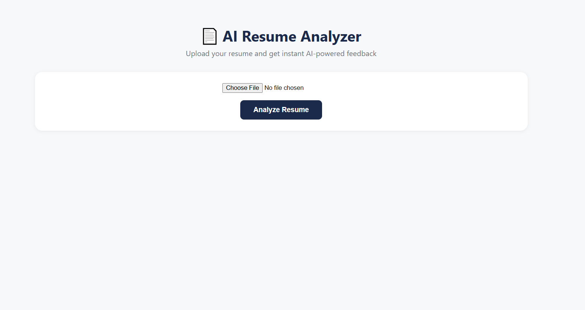
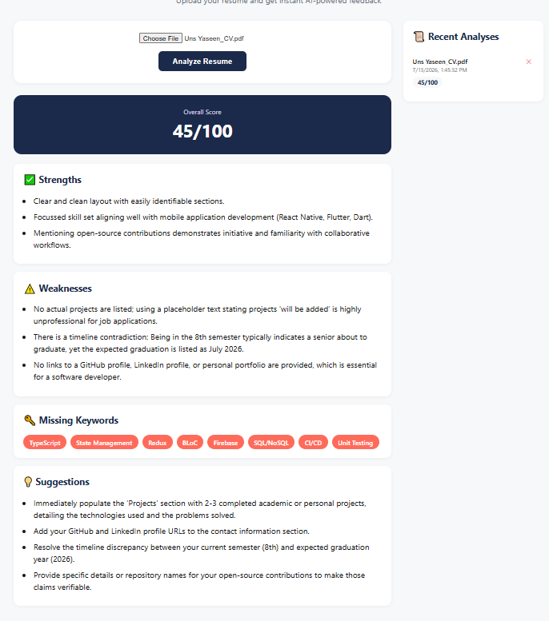

# AI Resume Analyzer 📄

An AI-powered web app that analyzes resumes and provides instant, actionable feedback using Google's Gemini AI.

## Features
- Upload a PDF resume for instant AI analysis
- Get an overall score, strengths, weaknesses, and missing keywords
- Actionable suggestions to improve resume quality
- Analysis history sidebar — view and revisit past analyses
- Delete past analysis records

## Screenshots

| Analysis View | History Sidebar |
|---------------|------------------|
|  |  |

## Tech Stack
**Frontend:** React (Vite), Axios
**Backend:** Node.js, Express, MongoDB, Mongoose
**AI:** Google Gemini API
**PDF Parsing:** pdf-parse

## Getting Started

**Backend:**
```bash
cd backend
npm install
npm run dev
```
Add a `.env` file with:

GEMINI_API_KEY=your_api_key
MONGO_URI=mongodb://localhost:27017/resumeanalyzer
PORT=5000

**Frontend:**
```bash
cd frontend
npm install
npm run dev
```

## Future Improvements
- Support for DOCX resume uploads
- Compare resume against a specific job description
- Export analysis as PDF report

## Author
Uns Yaseen