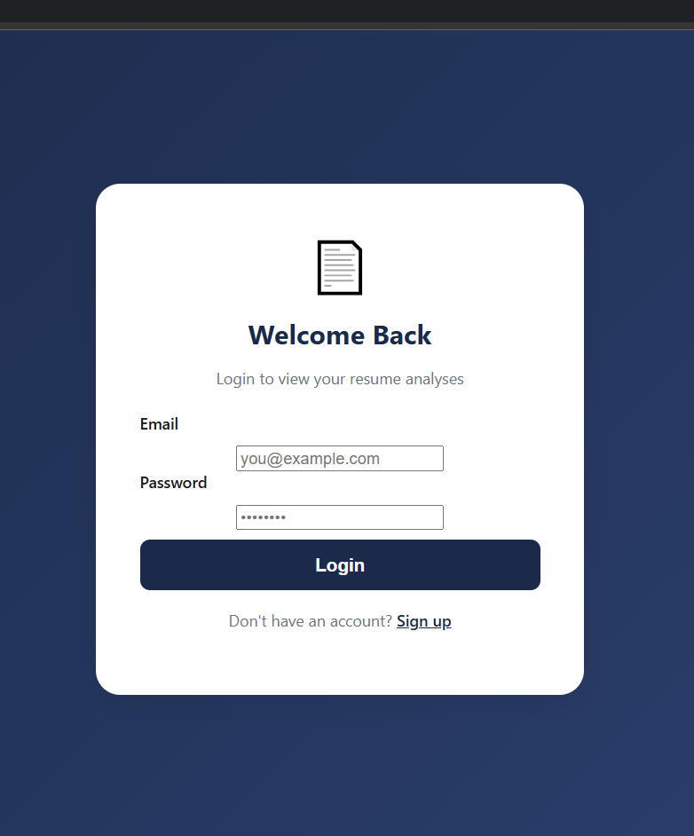
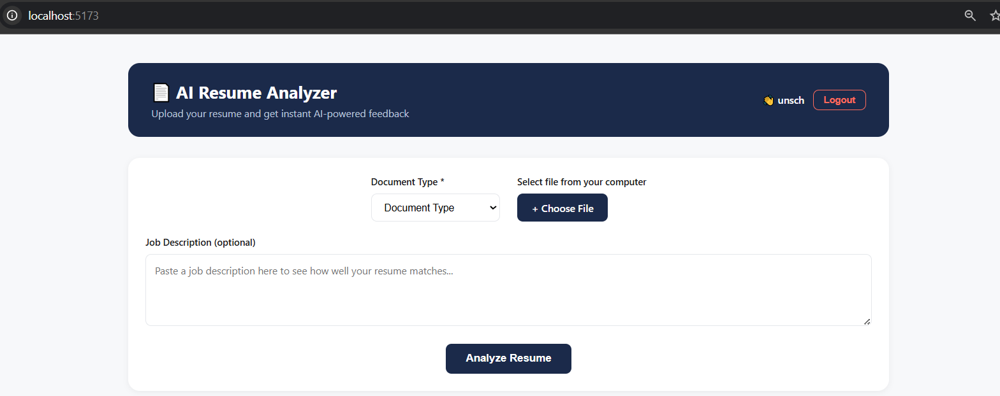
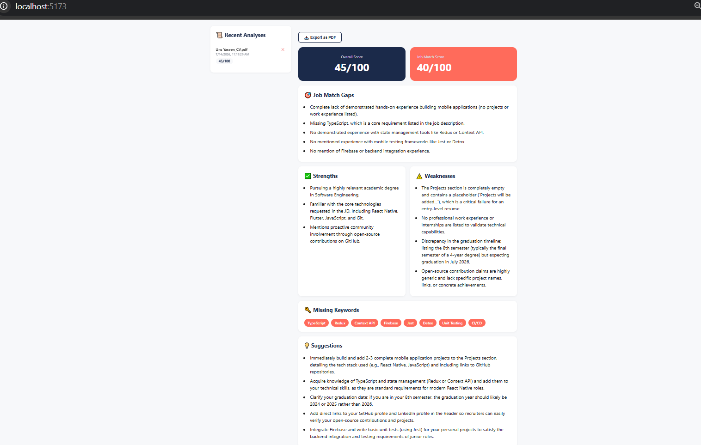
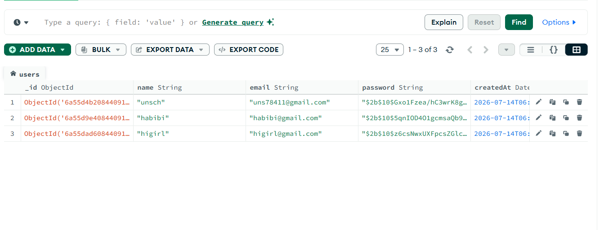

# AI Resume Analyzer 📄

A full-stack AI-powered web app that analyzes resumes and provides instant, actionable feedback using Google's Gemini AI — with user authentication, job-specific matching, and downloadable reports.

## Features
- 🔐 User authentication (signup/login) with JWT and hashed passwords
- 📄 Upload PDF or DOCX resumes for instant AI analysis
- 📊 Overall score, strengths, weaknesses, and missing keywords
- 🎯 **Job Description Matching** — paste a job posting to get a tailored match score and specific skill gaps
- 📥 **Export analysis as a PDF report**
- 📜 Personal analysis history — revisit or delete past analyses (per user)

## Screenshots

| Login | Signup |
|-------|--------|
|  |  |

| Upload | Analysis Results |
|--------|-------------------|
|  |  |

**Database (MongoDB):**


## Tech Stack
**Frontend:** React (Vite), React Router, Axios, jsPDF
**Backend:** Node.js, Express, MongoDB, Mongoose
**Auth:** JWT, bcryptjs
**AI:** Google Gemini API
**File Parsing:** pdf-parse, mammoth (DOCX)

## Project Structure
```
ResumeAnalyzer/
├── backend/     # Express API, MongoDB models, Gemini AI integration, JWT auth
└── frontend/    # React UI (Login, Signup, Analyzer)
```

## Getting Started

**Backend:**
```bash
cd backend
npm install
npm run dev
```
Add a `.env` file with:
```
GEMINI_API_KEY=your_api_key
MONGO_URI=mongodb://localhost:27017/resumeanalyzer
JWT_SECRET=your_random_secret_string
PORT=5000
```

**Frontend:**
```bash
cd frontend
npm install
npm run dev
```

## Future Improvements
- Password reset via email
- Resume formatting suggestions with visual examples
- Support for multiple resume comparisons side-by-side

## Author
Uns Yaseen